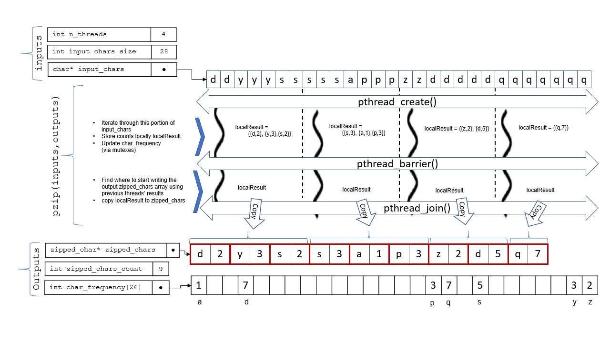

CSCI-442 Project 3: Parallel Zip
==============================

.. important::

   * You'll want to read this **entire document** before beginning the project.  Please ask any questions you have on Piazza, but only if this README does not answer your question.
   * Finally, be sure to start early.  If you wait until a few days before the due date, you are unlikely to finish in time.

This project has a single deadline: **November 2, 2020, 11:59:59 PM**. As outlined in the course syllabus, you may extend this deadline using slip days. 

Project Desciption
------------------

Learning Objectives
~~~~~~~~~~~~~~~~~~~
* Understand how to use multiple threads to finish a computation task faster.
* Become familiar with running concurrent threads with POSIX-threads library (pthreads) and the basic usage of concurrent data structures among parallel threads.
* Sharpen systems programming skills by working on a practical project.

Summary
~~~~~~~
For this project, you will implement a parallel zip (pzip) program, using the C programming language and POSIX-threads. The pzip will read an input text file, which is composed of lowercase letters (a-z) only. As an output it will produce a binary file indicating the consecutive uses of each character. The pzip operation needs to be done in paralel using pthreads library. 

The figure above shows an overview of the inputs, outputs and your program will flow. You are expected to implement the middle portion indicated by ``pzip(inputs,outputs)``. Within this function, there are three major steps that you should follow to establish the parallel threads logic:

* Call ``pthread_create()`` to launch parallel threads: Once threads are created they will iterate through an equal and dedicated portion of ``input_chars``, store the consecutive occurrence results locally, and also update a global ``char_frequency`` array that holds the total/global frequency of the occurences of each character.
* Call ``pthread_barrier()`` to synchronize the pthreads, without destroying them: This barrier is required to make sure that each thread has finished locally counting their portions of characters. Threads need to synchronize because each thread needs to know how many ``zipped_char`` structs they have in their localResult arrays, so that they can calculate the exact index of ``zipped_char`` array that they need to copy their local results into.
* Call ``pthread_join()`` to finish the parallel execution.

Please note that your code is expected **ONLY** to operate on the input and output data structures provided in the figure. 

.. warning::
   ``zipped_chars`` array holds consecutive occurrences, whereas ``char_frequency`` array holds the total number of occurrences. A character may appear more than once in ``zipped_chars`` array, whereas ``char_frequency`` is populated on-the-go as threads encounter each character. 

Functionality
~~~~~~~~~~~~~

After running ``make``, you should have an executable program named
``pzip`` located in the root of your repository.  The usage is as follows::

  pzip INPUT_FILE OUTPUT_FILE N_THREADS [--debug]

* ``INPUT_FILE``: The input file name which is contains only lowercase letters (a-z). The format is explained below.
* ``OUTPUT_FILE``: The output file name which will be the result of your program output. The format is explained below.
* ``N_THREADS``: The number of parallel threads that will be used during pzip.
* ``[--debug]``: Optional parameter to display the content of input/output variables. When this option is set, the output becomes a human readable text file. Otherwise, it is a binary file. We will test your program without this parameter. 

Assumptions
~~~~~~~~~~~

* The number of threads is assumed to be greater than or equal to zero.
* The number of characters in the input file is assumed to be a positive multiple of the number of threads.
* Each thread is expected to process an equal portion of the input characters.
* **IMPORTANT:** If the consecutive occurrence of a character spans two threads, you **SHOULD NOT** merge these two occurrences and **SHOULD** report them separately. For example, in the image above, the character ``s`` appears twice for the first thread and, again, the same letter appears three times in the portion processed by the second thread. In the final output, rather than counting ``s`` for 5 times, we have two counts of it, which are 2 and 3, respectively. 

What is implemented for you?
~~~~~~~~~~~~~~~~~~~~~~~~~~~~

* main() function in ``main/pzip.c`` (**DO NOT TOUCH THIS FILE**)
* Program parameter handling
* Input file reading, parsing and coversion (i.e., mapping) to ``input_chars`` array
* Output file formatting, writing and coversion (i.e., mapping) from ``zipped_chars`` array
* Debug output

To ease your implementation and to make grading fairer, using the starter code *is a requirement of this project*. You are **NOT ALLOWED** to make any modification to the main/pzip.c file. 

What are you expected to do?
~~~~~~~~~~~~~~~~~~~~~~~~~~~~~~~~

* **START FROM HERE**: Implement body of the ``pzip()`` function in ``src/pzip.c``
* In the same file, also create a callback pthread function that will be called by ``pthread_create()`` within ``pzip()`` function.
* By the end of pzip() function, properly populate output pointers to ``zipped_chars``, ``zipped_chars_count`` and ``char_frequency``. Please note that the memory for these arrays and variables will be allocated and freed for you by main().
* Implement other functions and global/local variables as you need. 

Input File Format
~~~~~~~~~~~~~~~~~

The input file is already into an ``input_chars`` array for you and the total number of chars in this file is provided to you in the ``input_chars_size`` variable. The input file is simply a text file that contains nothing but the 26 small case letters (i.e., a-z). There are no white spaces, line breaks, return characters or other characters. While you don't need to parse the input file, you need to know the format so that you can prepare your own test inputs. Example input:

* Input file content: ``aaeeoooooeee``
* int input_chars_size= 12;
* ``char* input = {'a','a','e','e','o','o','o','o','o','e','e','e'};``

You may generate inputs of any size of NUM by using the following script in your repository root::

  $ ./generate_chars.py NUM > test_input

Output Format
~~~~~~~~~~~~~

There are two output formats used by the program. Both of these formats are generated by the starter code using the  ``zipped_chars`` array.

1. Binary Output (Default)
^^^^^^^^^^^^^^^^^^^^^^^^^^

If the ``--debug`` option is not provided, the output of pzip is a binary file. This file is automatically generated using ``zipped_chars`` array and ``zipped_chars_count`` variable, which indicates the size of the array. 

2. Text Output (--debug mode)
^^^^^^^^^^^^^^^^^^^^^^^^^^^^^
If the ``--debug`` option is provided in the program arguments, the contents of the ``zipped_chars`` array will be written as human readable text file. Each line of the output file will consist of a charracter and the number of consecutive occurences of that character. 

Examples
^^^^^^^^

1. Example 1

* Input file content: ``aaeeoooooeee``
* ``int input_chars_size = 12;``
* ``char* input = {'a','a','e','e','o','o','o','o','o','e','e','e'};``
* ``int n_threads = 2;``
* ``struct zipped_char\* zipped_chars = {{'a',2}, {'e','2'},{'o',2},{'o',3},{'e',3}};``
* Binary output file (in hexa-decimal): ``61 02 65 02 6f 02 6f 03 65 03``
* Text (--debug) output file (in plain text, new lines are ommitted):      
  a 2 e 2 o 2 o 3 e 3

2. Example 2

* Input file content: ``aaeeoooooeeeeeeeeeeaaaaaaaaaadddddddddsssssssussssssyyyyyywwwwww``
* ``int input_chars_size = 64;``
* ``char* input = {`a`,`a`,`e`,`e`,`o`,`o`,`o`,`o`,`o`,`e`,`e`,`e`,`e`,`e`,`e`,`e`,`e`,`e`,`e`,`a`,`a`,`a`,`a`,`a`,`a`,`a`,`a`,`a`,`a`,`d`,`d`,`d`,`d`,`d`,`d`,`d`,`d`,`d`,`s`,`s`,`s`,`s`,`s`,`s`,`s`,`u`,`s`,`s`,`s`,`s`,`s`,`s`,`y`,`y`,`y`,`y`,`y`,`y`,`w`,`w`,`w`,`w`,`w`,`w`};``
* ``int n_threads = 4;``
* ``struct zipped_char\* zipped_chars = {{'a',2}, {'e','2'},{'o',5},{'e',7},{'e',3},{'a',10},{'d',3},{'d',6},{'s',7},{'u',1},{'s',2},{'s',4},{'y',6},{'w',6}};``
* Binary output file (in hexa-decimal): ``61 02 65 02 6f 05 65 07 65 03 61 0a 64 03 64 06 73 07 75 01 73 02 73 04 79 06 77 06``
* Text (--debug) output file (in plain text, new lines are ommitted):
  a 2 e 2 o 5 e 7 e 3 a 10 d 3 d 6 s 7 u 1 s 2 s 4 y 6 w 6

.. warning::
  Note that the zipped output file is not fully compressed. In example 1, the zipped chars could have been determined as {{'a',2}, {'e','2'},{'o',5},{'e',3}};``. However, for the sake of simplicity for the project, we do not ask parallel threads to talk to each other and merge their output. You are not asked to implement this functionality, and your program may not pass our automated tests if you implement this optimization.

Evaluation and Grading
-----------------------
Grading
~~~~~~~
We will be grading your code based on:

* Functionality and accuracy: Your program should produce the output as explained above. Please note that, due to the simplifications we have made, the output may change depending on the number of threads being used, if character sequences span thread boundaries, as in the example given in the figure. Your submitted code should have the same mains/pzip.c file as in the starter code.

* Parallelism and performance: Most of pzip, including input/output and reading/writing, will operate in parallel.  Your program should operate as shown in the Figure above. You should not do  the counting o serially. Serial creation and joining of threads is OK. 

* General requirements: Your program should follow the non-project-specific general requirements indicated below.

Performance Measurement
~~~~~~~~~~~~~~~~~~~~~~~
* To test whether your program properly AND efficiently use threads, we will run your program with large test files (e.g. test/input_large). We will use the following formula to evaluate the 'paralell efficiency', i.e., ``PE``, of your code:

  ``PE = ((CPU_TIME_USER+CPU_TIME_SYS)/WALL_TIME) / N_THREADS``

* In a perfectly parallel program, ``PE`` should be equal to 1.0, however this is never possible. Actual parallel efficiency will be less than 1.0. To measure the ``PE`` of your program via the measure.py script we provided, you may execute the following command::

  $ ./measure.py ./pzip /tmp/CSCI-442--DO-NOT-DELETE/input_huge ./out 8

Performance Criteria
~~~~~~~~~~~~~~~~~~~~~~~
* On Isengard, our solution for the parameters in the above command runs under 1 second (WALL_TIME < 1) with a ``PE`` greater than 0.75. 

* Your program is expected to run the command above on Isengard under 2 seconds (WALL_TIME < 2) with a pe greater than 0.5 (PE > 0.5). Please note that these values are valid only for the input file referenced above (/tmp/CSCI-442--DO-NOT-DELETE/input_huge) and with N_THREADS=8 on Isengard. Your first run may be slower due to internal page caching. You may take three runs and get the fastest one.

* If your code fails to meet the performance criteria above, you will get a partial grade, depending on how fast and efficient your code is.

* The top three fastest and correct submissions will be given +3, +2 and +1 extra points, respectively. 

General Requirements
--------------------
- You should handle errors gracefully.  For example, if you are not able
  to access a directory, print a relevant and descriptive error message
  to the ``stderr`` file stream (not ``stdout``), and continue to
  traverse the other directories you still have permission to.  Your
  program should have a non-zero exit status if any errors are
  encountered.

- Your program should have a zero exit status if no errors are
  encountered.

- Your project must be written in the C programming language, and
  execute on the Isengard lab machines.

- You should follow `Linux Kernel coding style`_, a common style guide
  for open-source C projects.  A small number of points will be
  deducted on projects which do not follow this style guide.

- Your project must not execute external programs or use network
  resources.

- Your project should be memory safe.  For example, if your program is
  susceptible to buffer-overflow based on certain inputs, it is not
  memory safe.  As a corollary to this, you should not use any of the
  following functions: ``strcat``, ``strcpy``, or ``sprintf``.

- You should ``free`` any memory that you heap-allocate, and ``close``
  (or ``closedir``) any files that you open.

- To compile your code, the grader should be able to ``cd`` into the
  root directory of your repository and run ``make`` using the
  provided ``Makefile``.

Resources
---------

You will be using the following pthread library calls:

- ``pthread_create``
- ``pthread_join``
- ``pthread_mutex_init``
- ``pthread_barrier_init``
- ``pthread_mutex_lock``
- ``pthread_mutex_unlock``
- ``pthread_barrier_wait``

Please refer to https://computing.llnl.gov/tutorials/pthreads/ for tutorials on how to use pthreads. 

Collaboration Policy
--------------------

This is an **individual project**.  All code you submit should be
written by yourself.  You should not share your code with others.

Please see the syllabus for the full collaboration policy.

.. warning::

   **Plagarism will be punished harshly!**

Access to Isengard
------------------

We have changed the standard grading environment from the ALAMODE lab
to Isengard with this project, as the functionality of the ALAMODE
machines has been deteriorating this semester [1]_.

Remote access to Isengard is quite similar to ALAMODE, but the
hostname is ``isengard.mines.edu``.

For example, to ``ssh`` into the machine with your campus MultiPass
login, use this command::

  $ ssh username@isengard.mines.edu

Note: you need to be on the campus network or VPN for this to work.
If you are working from home, use either the VPN or hop thru
``imagine.mines.edu`` first.

.. [1] Standard editors like Emacs and Vim have stopped functioning,
   and we've even noticed compiler issues on some machines.  We
   presume CCIT is struggling to maintain these machines with limited
   lab access due to COVID.
